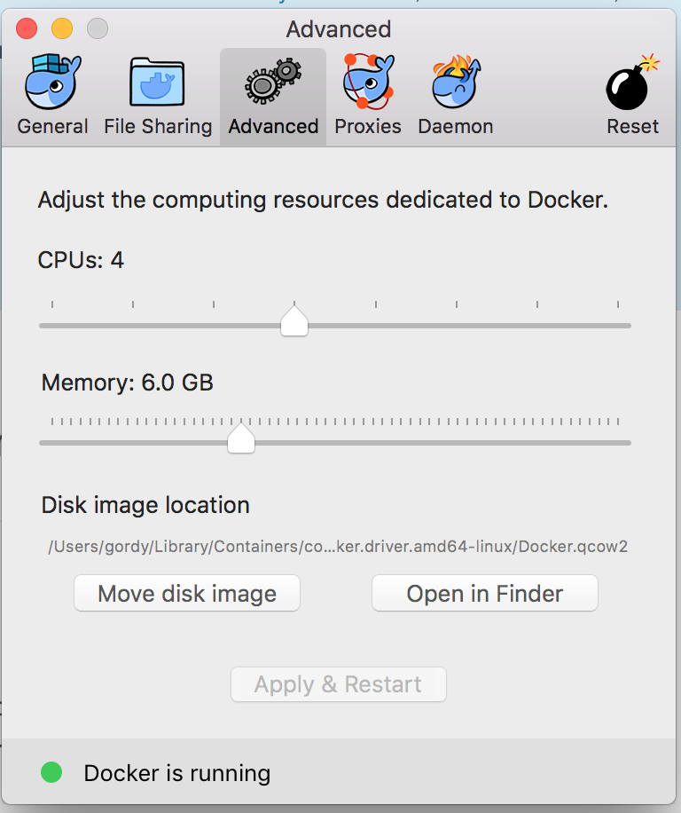

# Docker Installation/Configuration

Three different Docker installation/configuration instructions are provided below.

1. Docker for Mac (recommended for Mac users)
2. Docker + Virtualbox (alternate Mac installation)
3. Linux (tested on Ubuntu 16.04)

## Docker for Mac

If you are running [Docker for Mac](https://www.docker.com/docker-mac), you should update
_Preferences/Advanced_ as follows:

You can install _Docker for Mac_ in two ways:

1. You can download it from [here](https://store.docker.com/editions/community/docker-ce-desktop-mac).  Get the _Stable_ version.
2. You can install it via [Homebrew Cask](https://github.com/caskroom/homebrew-cask)

### Installing Docker for Mac via Homebrew Cask

I assume you have already installed [Homebrew](https://brew.sh/) and [Homebrew Cask](https://github.com/caskroom/homebrew-cask). If so, just do the following.

	$ brew update
	$ brew cask install docker

### Docker + Virtualbox

First step is to install [Virtualbox](https://www.virtualbox.org/wiki/VirtualBox).  I use [Homebrew Cask](https://caskroom.github.io/) for this, so installation is done as follows:

	brew cask install virtualbox virtualbox-extension-pack

Next step is to install the required Docker components.  I use [Homebrew](https://brew.sh/) for this:

	brew install docker docker-compose docker-machine

Once you have installed the prerequisites, the next step is to [Docker Machine](https://docs.docker.com/machine/overview/) to create a Docker host in Virtualbox.  This is what will actually host the containers that you run.

	docker-machine create --virtualbox-disk-size 32000 --virtualbox-memory 6144 --virtualbox-cpu-count 4 --driver virtualbox default

Then add the required environment variable to your `$HOME/.profile`.  You may see these variables by issuing the following command:

    $ docker-machine env
    export DOCKER_TLS_VERIFY="1"
    export DOCKER_HOST="tcp://192.168.99.100:2376"
    export DOCKER_CERT_PATH="/Users/gordy/.docker/machine/machines/default"
    export DOCKER_MACHINE_NAME="default"
    # Run this command to configure your shell:
    # eval $(docker-machine env)

## Linux (Ubuntu 16.04)

Add GPG key for official Docker repository.

	curl -fsSL https://download.docker.com/linux/ubuntu/gpg | sudo apt-key add -

Add the Docker repository to APT sources.

	sudo add-apt-repository "deb [arch=amd64] https://download.docker.com/linux/ubuntu $(lsb_release -cs) stable"

Next, update the package database with the Docker packages from the newly added repo:

	sudo apt-get update

Make sure you are about to install from the Docker repo instead of the default Ubuntu 16.04 repo.

	apt-cache policy docker-ce

Install Docker.

	sudo apt-get install -y docker-ce

Verify is running.

    sudo systemctl status docker
    ● docker.service - Docker Application Container Engine
       Loaded: loaded (/lib/systemd/system/docker.service; enabled; vendor preset: enabled)
       Active: active (running) since Tue 2017-08-01 14:38:48 CDT; 5s ago
         Docs: https://docs.docker.com
     Main PID: 6430 (dockerd)
       CGroup: /system.slice/docker.service
               ├─6430 /usr/bin/dockerd -H fd://
               └─6443 docker-containerd -l unix:///var/run/docker/libcontainerd/docker-containerd.sock

Add (your host) user to the docker group. This is so you do not have
to use sudo with all of the docker commands.

	sudo usermod -aG docker ${USER}

Install docker-compose.

    sudo mkdir -p /usr/local/bin
    sudo chown ${USER}:${USER} /usr/local/bin
    curl -L https://github.com/docker/compose/releases/download/1.21.1/docker-compose-`uname -s`-`uname -m` > /usr/local/bin/docker-compose
    sudo chmod +x /usr/local/bin/docker-compose

